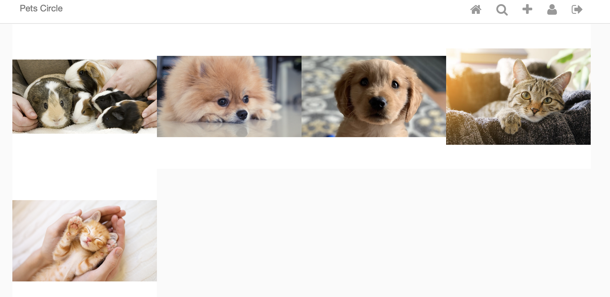

# instagram_project_django

This is a full stack web application similar to instagram designed by Django using MVC design pattern. The main functionality includes: CRUD posts, follow/unfollow user, master/detail view of posts, like and comment the posts, authentication and authorization 

  
  

  

To start with the project, user should firstly make sure the project is running in the python3 environment and get all the required libraries in the Pipfile installed. 

To start a local server , user should type:

  <code>python3 manage.py runserver</code>
  
  
To use the default sqlite database for testing, user should use the following command to generate new sqlite database:

<code> python3 manage.py makemigrations</code>  

<code> python3 manage.py migrate</code> 

